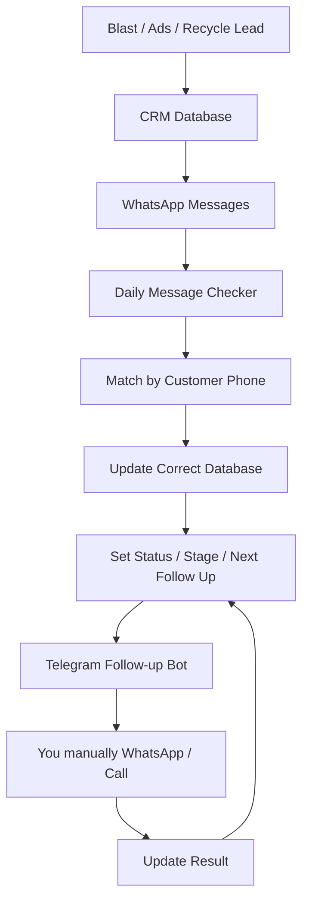

# Mamba Sales OS Blueprint

## Core Idea

Mamba Sales OS is not meant to be a random AI auto-reply system.

The goal is to build a clean **Sales Tracking + Follow-up Reminder System**.

The system should help answer:

- Where did this customer come from?
- Which WhatsApp number contacted or received this customer?
- Did the customer reply?
- What is the customer status now?
- When should we follow up next?
- What angle should we use for the next follow-up?

The important principle:

> AI should not randomly decide everything. The system should first run on clear rules, clean tracking, and simple workflows.

---

## Three Things We Must Separate

### 1. Lead Source

This tells us where the customer came from.

Examples:

- Blast
- Ads
- Recycle / Call List
- Unknown WhatsApp Inbound

### 2. Sender / Receiver Number

This tells us which WhatsApp number is involved.

Examples:

- `wa_01` = WhatsApp number A
- `wa_02` = WhatsApp number B
- `wa_03` = WhatsApp number C

### 3. Customer Identity

This tells us who the customer is.

The most important unique identifier is:

- Customer phone number

Example:

```text
Customer Phone = 6012xxxxxxx
```

The system should always track both:

- The customer's phone number
- The WhatsApp instance / number that contacted or received the customer

---

## CRM Database Structure

For now, we keep three separate Notion databases.

This keeps the CRM clean and avoids mixing very different lead types together.

### 1. Mamba | Blast Leads

Used for customers from WhatsApp blasting.

Main purpose:

- Track blast leads
- Track template sent
- Track project sent
- Track sender number
- Track blast time
- Track customer reply

Extra fields:

- Project
- Template Sent
- Image Sent
- Last Blast At
- Sender Instance
- Sender Number
- Reply Count
- Last Reply At
- Last Reply Text

### 2. Mamba | Ads Leads

Used for leads that come directly from ads into WhatsApp.

Main purpose:

- Track new ad enquiries
- Track enquiry source
- Track first response
- Track appointment / showroom progress

Extra fields:

- Ad Source
- Campaign Name
- First Enquiry At
- Interested Project

### 3. Mamba | Recycle Leads

Used for boss-provided old numbers, recycle lists, and call lists.

Main purpose:

- Track call outcome
- Track who has not been called
- Track who should be called again
- Track who can receive occasional blast

Extra fields:

- Call Date
- Call Time
- Last Call Outcome
- Call Count
- Blast Eligible

---

## Future Option: Master Contacts

Later, if the system becomes bigger, we can create:

```text
Mamba | Master Contacts
```

That database would become the central customer identity database.

But for now, we should not add it yet because it will make the system more complicated.

Current stage priority:

- Keep databases clean
- Track replies correctly
- Build follow-up habit first

---

## Core Fields for Every Lead

No matter if the lead comes from Blast, Ads, or Recycle, each lead should ideally have these fields:

```text
Name
Phone
Lead Source
Lead Status
Follow Up Stage
Lead Temperature
Assigned WhatsApp Instance
Assigned WhatsApp Number
Last Customer Reply At
Last Customer Reply Text
Last Action
Last Action At
Next Follow Up Date
Next Follow Up Angle
Remark
```

These fields allow the system to know:

- What happened last
- What should happen next
- When to remind you
- Which message angle is suitable

---

## Listener / Daily Checker Philosophy

We do not need to rely only on a real-time listener.

A better and safer early version is:

```text
Daily Message Settlement
```

This means the system can read WhatsApp messages for the day:

```text
00:00 - 23:59
```

Across all connected WhatsApp instances:

```text
wa_01
wa_02
wa_03
```

Then the system checks:

- Who replied today?
- Which WhatsApp number received the reply?
- What did the customer say?
- Which database does this customer belong to?

---

## What Each Incoming Message Should Record

Each incoming WhatsApp message should be saved with:

```text
Customer Phone
Received On Instance
Received On Number
Message Time
Message Text
Message ID
```

This is important because you may use multiple WhatsApp numbers later.

Example:

```text
Customer Phone: 60123456789
Received On Instance: wa_02
Received On Number: +6016xxxx8756
Message Time: 2026-06-25 14:32
Message Text: Can send me price list?
```

---

## Source Resolver Logic

The system should use the customer's phone number to find which database the lead belongs to.

Recommended search priority:

```text
1. Mamba | Blast Leads
2. Mamba | Ads Leads
3. Mamba | Recycle Leads
4. Unknown WhatsApp Inbound
```

### If Found in Blast Leads

```text
Source = Blast
Status = Warm
Last Customer Reply At = message time
Last Customer Reply Text = message text
Received On Instance = wa_xx
Next Follow Up Date = tomorrow
Next Follow Up Angle = Qualify / Ask Layout
```

### If Found in Ads Leads

```text
Source = Ads
Status = Warm / Replied
Last Customer Reply At = message time
Last Customer Reply Text = message text
Received On Instance = wa_xx
Next Follow Up Date = tomorrow
Next Follow Up Angle = Qualify
```

### If Found in Recycle Leads

```text
Source = Recycle
Status = Warm
Last Customer Reply At = message time
Last Customer Reply Text = message text
Received On Instance = wa_xx
Next Follow Up Date = tomorrow
Next Follow Up Angle = Follow Up
```

### If Not Found Anywhere

```text
Source = Unknown WhatsApp Inbound
Status = Needs Review
```

Because ads leads can enter WhatsApp directly, many unknown inbound messages may actually be ads leads.

But we should not automatically assume every unknown message is an ad lead.

Some may be:

- Friends
- Existing clients
- Suppliers
- Wrong numbers
- Personal messages

So unknown inbound should go into a review bucket first.

---

## Ignore List

We should eventually create an ignore list.

This prevents the system from tracking personal or irrelevant messages as sales leads.

Examples:

- Your own numbers
- Friends
- Team members
- Suppliers
- Developers
- Family

---

## Follow-up Bot Philosophy

The Follow-up Bot should not automatically WhatsApp the customer in the early stage.

Its job is to remind you:

- Who to follow up
- Why now
- What angle to use
- What message you can send

Example reminder:

```text
Follow Up Due

Name: Mark
Source: Blast
Received On: wa_02 / +60xxxx8756
Stage: Info Sent
Reason: Sent floor plan yesterday, no reply
Angle: Ask Layout

Suggested Message:
Hi Mark, did you manage to look through the floor plans?
Which layout do you feel more suitable?
```

---

## Follow-up Stages

Suggested stages:

```text
New
Warm
Info Sent
Waiting Reply
Interested
Showroom Invite
Appointment Set
No Response
Recycle
Closed
Do Not Contact
```

---

## Follow-up Angles

Suggested follow-up angles:

```text
Ask Layout
Ask Budget
Ask Purpose
Package Update
Invite Showroom
Rental Investment
Own Stay
Soft Check-in
Confirm Appointment
Occasional Update
```

---

## Simple Follow-up Timing Rules

### Customer Replied / Asked for Info

```text
Action: Send brochure / floor plan / price list
Next Follow Up Date: +1 day
Next Angle: Ask Layout
```

### Sent Info but No Reply

```text
After 24 hours:
Next Angle: Ask Layout
```

### Still No Reply After First Follow-up

```text
After 2-3 days:
Next Angle: Ask Budget / Ask Purpose
```

### Customer Interested but No Appointment

```text
After 1-2 days:
Next Angle: Invite Showroom
```

### Customer Says Not Now / Not Looking

```text
Next Follow Up Date: +30 days
Next Angle: Occasional Update
Status: Recycle / Occasional Blast
```

### Long No Response

```text
After 14-30 days:
Status: Recycle
Next Angle: Occasional Update
```

---

## Full System Flow



---

## Modules We Need to Build

### 1. Daily Message Checker

Reads incoming WhatsApp messages from all connected instances.

Purpose:

- Check who replied today
- Track which WhatsApp number received the reply
- Save message text and time

### 2. Source Resolver

Matches the customer phone number against:

```text
Mamba | Blast Leads
Mamba | Ads Leads
Mamba | Recycle Leads
```

If no match is found, mark as:

```text
Unknown WhatsApp Inbound
```

### 3. Notion Status Updater

Updates the correct Notion database.

Common update:

```text
Status = Warm
Last Customer Reply At = message time
Last Customer Reply Text = message text
Received On Instance = wa_xx
Next Follow Up Date = tomorrow
Next Follow Up Angle = Qualify / Ask Layout
```

### 4. Follow-up Rule Engine

Uses the lead's current stage to calculate:

- Next follow-up date
- Next follow-up angle
- Suggested message

### 5. Telegram Follow-up Bot

Sends reminders to you.

Recommended schedule:

```text
9:00am - Today Follow-up List
10:00am to 9:00pm - hourly check
After 9:00pm - no reminders
```

### 6. Simple Follow-up Console

Later, we can build a simple HTML page with buttons:

```text
Done
Snooze 1 Day
Interested
Invite Showroom
Move Recycle
Do Not Contact
```

This makes manual updating much easier.

---

## What We Should Not Build Yet

At the current stage, avoid:

- Automatic WhatsApp follow-up
- AI randomly classifying every customer
- Complex Activity Logs database
- Too many database relations
- Full automatic appointment booking
- Too many statuses that are hard to maintain

Current priority:

```text
Track accurately
Do not miss follow-up
Keep statuses clean
Know what to do every day
```

---

## Recommended V1

The first proper version should be:

```text
3 Notion databases
+ Daily WhatsApp Message Checker
+ Source Resolver
+ Status Updater
+ Telegram Follow-up Reminder
```

V1 should not auto-message customers.

The workflow should be:

```text
System detects reply
System updates CRM
System sets next follow-up
Telegram reminds you
You manually WhatsApp or call
You update result
```

This is safer, cleaner, and better for improving sales quality.

