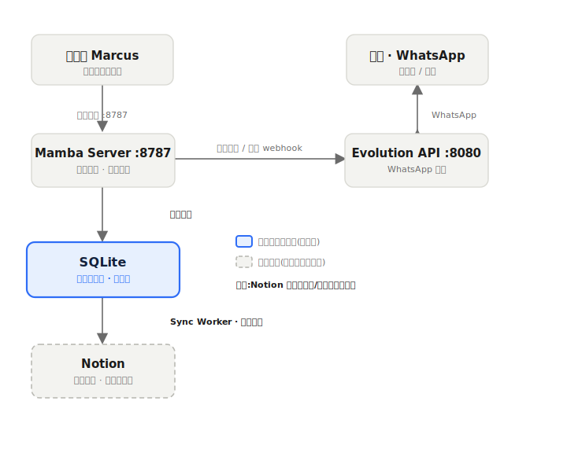

# MAMBA ADR-001 — 数据架构:本地优先(SQLite 主库 + Notion 异步镜像)

> **状态**:已采纳(Accepted) · **日期**:2026-07-17 · **决策人**:Marcus
> 这是一份架构决策记录(ADR)。记录"为什么这么选",以后自己或另一台电脑的你回头看就不用重新纠结。

---

## 一、背景(Context)

Mamba 是房产销售用的 WhatsApp 批量群发 + 多轮自动跟进系统,当前运行方式是 **一台 Mac 对应一个 WhatsApp 号码**。系统由三大件组成:

- **Mamba Server**(`:8787`)—— 核心大脑,所有逻辑和网页面板。
- **Evolution API**(`:8080`)—— WhatsApp 引擎,负责收发消息。
- **Notion** —— 至今为止的"数据后端":名单、模板、发送记录都在这。

**触发这次决策的问题**:Notion 被放在了发送/回复的关键路径上。它慢、有 API 限流。一旦超时(2026-07-17 当天就积压了 **153 条回复等待写入 Notion**),整条流程就卡住,回复堆着写不进去。数据虽然没丢(本机有留存),但把一个云端 SaaS 摆在实时业务的关键路径上,是结构性风险。

同时,2026-07-17 已经落地了本机 SQLite 数据库壳(`campaign-data/mamba.sqlite`,Schema v1,预留了 `sync_jobs` 做 Notion 双向同步 + 幂等键 + 失败重试),方向已经对了,这份 ADR 把它正式确定下来。

---

## 二、决策(Decision)

采用 **本地优先(local-first)** 架构:

**SQLite 是本机的"运行真相源",坐在热路径正中间;Notion 退为"异步镜像 + 给人看的面板";Evolution 只负责收发 WhatsApp。**

```
Blast(Mamba) ⇄ SQLite(本机主库) ⇄ Sync Worker ⇄ Notion(云端镜像/面板)
                                     Evolution 只管收发 WhatsApp
```



要点:任何操作都**先落地本机 SQLite**(毫秒级、断网也能跑),Notion 由后台的 Sync Worker **慢慢补**。Notion 挂了或限流,发送和收回复照跑不误,等它恢复自动追平。

---

## 三、三条数据流

### 出站(群发)
1. Marcus 在面板点发送。
2. Mamba 从 **SQLite** 读名单 + 话术状态(不再实时打 Notion)。
3. Mamba → Evolution API → WhatsApp 发出。
4. 发完把"已发 / 推进到下一轮"**先写 SQLite**。
5. Sync Worker 再异步把这些记录推给 Notion。

### 入站(回复)
1. 客户回复 → Evolution webhook → Mamba(Reply Tracker)。
2. 分类、STOP 处理、更新客户状态 → **先写 SQLite**。
3. Sync Worker 异步推给 Notion。
   > 今天积压的 153 条,在新模型下就是"已经安全落 SQLite,正在慢慢补 Notion",而不是"卡住"。

### 人工内容
1. Marcus 在 Notion 里手改模板 / Project Knowledge / 脑库。
2. Sync Worker 把 Notion **拉下来**更新 SQLite。
3. Mamba 运行时**只读 SQLite**。

---

## 四、同步方向规则(关键)

同步不是无脑双向覆盖,方向按数据类型分,避免冲突:

| 数据类型 | 真相源 | 同步方向 |
|---|---|---|
| 运行数据(flow 状态、发送记录、回复、STOP、Reply Count) | **SQLite** | SQLite → Notion(上推) |
| 人工内容(话术模板、Project Knowledge、脑库、手工改的客户备注) | **Notion** | Notion → SQLite(下拉) |

这样就不会出现"你在 Notion 改的模板被本机旧数据盖回去"这种冲突。同步用 `sync_jobs` 里的幂等键,失败自动重试。

---

## 五、两条铁律(贴墙)

1. **Notion 永远不进"发送 / 回复"的关键路径。** 它只做异步镜像和人看的面板。任何"发送前必须先写成功 Notion 才继续"的逻辑都要拆掉。
2. **`.sqlite` 文件本身绝不跨机同步。** 不放 iCloud / Dropbox / Git —— 两台机器同时写同一个文件会直接损坏数据库。跨设备一致性只能走 Notion 这一层。本机那个 `mamba.sqlite` 永远只属于本机,继续用 `.gitignore` 挡掉。

**补充实践**:SQLite 开 WAL 模式(`PRAGMA journal_mode=WAL`),让读写不互相阻塞,Customer Desk 这类频繁刷新的页面体验更好。

---

## 六、为什么选 SQLite,不选 Postgres / MySQL

- **数据量很小**:当前 blast leads 缓存约 1.2MB(几百到一两千客户),回复 350 条。SQLite 轻松扛几万到几十万行,远没到上限。
- **架构是"一台 Mac = 一个号码"**:数据天然隔离(Device Ownership 在强化这点),不需要中心数据库服务器。
- **运维成本零**:无常驻服务、不占端口、离线可用、备份就是复制一个文件。
- **已有云端真相源**:跨设备共享由 Notion 扛,SQLite 只做本机运行账本。

**真正的瓶颈不是数据库**:先撞墙的一定是 WhatsApp 号码的发送上限(发太猛被封)和 Notion 限流,不是 SQLite。

### 不要做的两件事
- **不用 MySQL**:对本项目没有比 Postgres 更强的地方,没理由选。
- **不把 Mamba 的表塞进 Evolution 自己的 PostgreSQL**:耦合后升级/重装 Evolution 会连累业务数据。

---

## 七、什么时候才迁移到 Postgres(看条件,不看日历)

以下**任何一条真的发生**了,再迁到**托管版 PostgreSQL**(Supabase / Neon / RDS,省得自己维护服务器):

- 多台电脑需要**实时编辑同一批客户**(不再各管各的号码),而 Notion 速度/限流扛不住;
- 系统**集中到一台 Mac Mini / 服务器**常驻,多个号码共用一套数据(对应路线图 I2);
- 出现**多进程同时写**导致 SQLite 锁竞争明显变慢。

迁移时数据流不变,只是把中间的"SQLite 本机主库"换成"共享 Postgres",Notion 仍是异步镜像/面板。

---

## 八、后果(Consequences)

**好处**
- Notion 超时不再阻塞发送和回复;153 条这类积压变成"后台慢慢补",不影响业务。
- 运行时读本机 SQLite,页面更快,Notion API 调用量大幅下降(更少撞限流)。
- 断网也能继续发送和记录。

**代价 / 注意**
- 需要写并维护 Sync Worker(双向、按类型定方向、幂等 + 重试)。
- Notion 上看到的数据是"最终一致",可能比本机晚几秒到几分钟 —— 这是有意的权衡。
- 冲突处理要靠"同步方向规则"这张表守住,不能无脑双向覆盖。

---

## 九、考虑过但否决的方案

| 方案 | 否决原因 |
|---|---|
| 维持现状(Notion 当主库,在关键路径上) | 就是当前积压的根因;云端 SaaS 不该在实时业务关键路径上。 |
| 直接上自建 PostgreSQL | 当前数据量/架构用不上,平白增加常驻服务和运维负担。 |
| 用 MySQL | 相比 Postgres 无优势,生态和 JSON 支持更弱。 |
| 把表写进 Evolution 的 PostgreSQL | 与 WhatsApp 引擎耦合,升级/重装有连累业务数据的风险。 |
| 跨机同步 `.sqlite` 文件(iCloud/Dropbox) | 多写者会损坏数据库;一致性必须走 Notion 层。 |

---

## 十、相关文档
- `README.md` —— 系统总览与工作流
- `docs/updates/2026-07-17.md` —— SQLite 数据库壳落地记录
- `docs/MAMBA_DATABASE_KEYS.md` —— Notion 数据库字段
- `docs/MAMBA_TASKS.md` —— 双轨作战板(路线图 I2 = 迁移 Mac Mini)
