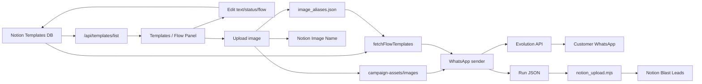

# Mamba Templates / Images / Notion Data Flow

Last updated: 2026-07-08

这份文件说明 Mamba 现在的模板系统是怎样从 Notion 读取、怎样绑定图片、怎样发送到 WhatsApp、以及哪些数据会写回 Notion。

核心结论:

- 模板内容的主来源是 Notion 的 `Mamba | Templates` database。
- 图片文件本体存在本机 repo 的 `campaign-assets/images/`。
- Notion 里面的 `Image Name` 不是图片文件名，而是一个 alias key。
- alias key 会在 `campaign-assets/image_aliases.json` 里面映射到真正的本地图片文件。
- WhatsApp 发送时直接读本地图片文件，不是直接从 Notion 或 Cloudflare 发图。
- LIVE Flow 1 blast 后，会把客户名单上传/补写进 Notion 的 `Mamba | Blast Leads`。
- Next Flow 发送后，会推进 Notion 里的客户 flow 状态，并更新模板的 `Sent Count`。

## 1. 重要文件

| 文件 | 用途 |
| --- | --- |
| `campaign-app/server.mjs` | Mamba web console 的主 backend。负责读取 Notion 模板、保存模板、上传图片、发送预览、开始 blast、推进 flow。 |
| `campaign-app/templates.html` | Templates / Flow 面板。你在这里编辑模板、拖动模板、上传图片。 |
| `campaign-app/console.html` | First Flow blast console。导入 Excel、选择 TEST/LIVE、生成预览、开始发送。 |
| `campaign-app/next-flow.html` | 选人发下一轮。根据 Notion 里的客户状态拉出下一轮名单。 |
| `campaign-app/notion_upload.mjs` | LIVE Flow 1 blast 后，把发送过的客户上传到 Notion Blast Leads。 |
| `campaign-app/cloudflare_assets_sync.mjs` | 把本地图片同步到 Cloudflare R2，主要用于备份/分享/跨电脑资产同步。 |
| `campaign-data/notion_config.json` | Notion database id / data source id / project alias 配置。这里没有 token。 |
| `campaign-assets/image_aliases.json` | `Image Name` alias 到本地图片文件名的映射。 |
| `campaign-assets/images/` | WhatsApp 真正发送时读取的本地图片文件夹。 |
| `evolution-pilot/.env` | 本机 secret 设置，例如 Notion token、Telegram token、Evolution API key。这个不要上传 GitHub。 |

## 2. Notion 配置在哪里

Notion database id 写在:

```text
campaign-data/notion_config.json
```

目前关键项目:

| Config key | 代表 |
| --- | --- |
| `databases.templates` | 模板 database，也就是 Templates / Flow 面板读取的地方。 |
| `databases.images` | 图片/素材 database。现在主要用于 relation 和统计。 |
| `databases.blastLeads` | 已 blast / 后续 flow 追踪的客户 database。 |
| `databases.campaignRuns` | 每次 campaign run 的记录 database。 |
| `dataSources.*` | Notion 新版 data source id。部分工具会用，但模板 query 主要用 database id。 |
| `project` | 默认 project。 |
| `projectAlias` | 本地项目名到 Notion 项目名的映射。 |

Notion token 不在这个 JSON 里面。token 从这里读:

```text
evolution-pilot/.env
```

backend 会找:

```text
NOTION_API_KEY=...
NOTION_TOKEN=...
```

如果页面显示没有 Notion token，通常是 `.env` 没写进去，或者 Mamba server 不是从同一个 folder 启动。

## 3. 模板是怎么 retrieve 的

### Templates 页面

打开:

```text
http://127.0.0.1:8787/templates
```

前端会调用:

```text
GET /api/templates/list?project=<Project>
```

backend 做这些事:

1. 从 `campaign-data/notion_config.json` 读取 `databases.templates`。
2. 去 Notion query 整个 Templates database。
3. 根据 `Project` 过滤当前项目。
4. 把 Notion page 转成前端可以显示的模板卡片。

会读取这些 Notion 字段:

| Notion 字段 | 用途 |
| --- | --- |
| `Template Name` | 模板标题。 |
| `Project` | 属于哪个项目，例如 `Gen Starz` / `Binastra`。 |
| `Flow Topic` | 最重要的 flow 匹配字段，例如 `Project Template`、`Layout`、`Location`。 |
| `Flow No` | Flow 编号，主要用于排序和显示。 |
| `Cohort Day` | 第几天发，主要是辅助显示。真正匹配发送时优先看 `Flow Topic`。 |
| `Language` | `EN` / `ZH` / `BM`。 |
| `Part` | `Part 1`、`Part 2`、`Part 3`、`Follow Up`。 |
| `Status` | `Active` 才会正式发送；`Testing` 可用于 Mobile Preview 草稿。 |
| `Message Text` | WhatsApp 要发的文字。 |
| `Image Name` | 图片 alias key，不是文件名。 |
| `Images` | Notion relation。用于图片统计/credit，不是直接发送路径。 |

### 发送时读取模板

发送时核心函数是:

```text
fetchFlowTemplates(projectName, flowLabel, { includeTesting })
```

它会:

1. 把 `flowLabel` 转成 `Flow Topic`。
2. 把本地 project 名通过 `projectAlias` 转成 Notion project 名。
3. 在 Notion Templates database 里 query:
   - `Flow Topic` 等于当前 flow topic
   - `Project` 等于当前 project
   - `Status` 等于 `Active`
4. 如果是 Mobile Preview，`includeTesting=true` 时会同时允许 `Testing`。
5. 按 `Language` 和 `Part` 分组。

分组结构大概是:

```js
{
  EN: {
    parts: {
      1: [templateVariantA, templateVariantB],
      2: [templateVariantC],
      3: [templateVariantD]
    }
  }
}
```

Part 排序规则:

| Part | 发送顺序 |
| --- | --- |
| `Part 1` | 第 1 条 |
| `Part 2` | 第 2 条 |
| `Part 3` | 第 3 条 |
| `Part 4`... | 继续往后 |
| `Follow Up` | 最后发送 |
| 空白/其他 | 默认当作 `Part 1` |

如果同一个 Part 有多个 Active variant，发送时会随机抽一个，用来做模板轮换。

## 4. First Flow 和 Next Flow 怎样用模板

### First Flow blast

First Flow 是导入 Excel 后第一次发。

流程:

1. 你在 `Campaign Console` 导入 Excel。
2. 按 `生成预览`。
3. backend 先建立客户 assignments。
4. 然后调用 `applyNotionFlowTemplatesToState(...)`。
5. 它会强制用 Notion 的 Flow 1 模板。
6. 每个客户会被填入:
   - `part1Text`
   - `part1Media`
   - `part2Text`
   - `part2Media`
   - `extraParts`
   - `tplCredit`

`[Name]` / `[名字]` 会在这里换成客户名字。

开始 LIVE 发送前，backend 会再确认一次这个 preview 是 Flow 1，避免混到其他 flow。

### Next Flow

Next Flow 是从 Notion Blast Leads 里面找该继续的人。

流程:

1. `next-flow.html` 根据 Notion 客户状态找人。
2. 例如客户的 `Next Flow` 是 `Flow 2 - Layout`，就只会拉 Flow 2。
3. 生成预览时，backend 根据这个 flow label 去 Templates database 找对应 `Flow Topic`。
4. 发送成功后，会自动把客户推进下一轮:
   - `Last Flow Sent`
   - `Next Flow`
   - `Cohort Day`
   - `Follow Up Due`
   - `Sequence Status`

所以如果 Notion 那边全部显示 Flow 1，通常不是图片问题，而是客户的 flow 状态还没推进，或者 Templates 的 `Flow Topic` / `Status` 设置错。

## 5. 图片是怎么绑定和发送的

图片有三层:

| 层 | 位置 | 说明 |
| --- | --- | --- |
| Notion 字段 | `Image Name` | 一个 alias key，例如 `[Gen Starz][Location][EN][Part 1][pageId]`。 |
| Alias map | `campaign-assets/image_aliases.json` | 把 alias key 映射到真正文件名。 |
| 本地文件 | `campaign-assets/images/<filename>` | WhatsApp 发送时读取的文件。 |

backend 的图片解析逻辑:

```text
Image Name -> image_aliases.json -> campaign-assets/images/<filename>
```

如果 `Image Name` 有值，但 `image_aliases.json` 找不到，或者本地图片文件不存在，Templates 页面会显示本地没有图，发送时也不会带图。

如果 `Image Name` 直接是 `xxx.jpg` / `xxx.png`，backend 也会尝试当作:

```text
campaign-assets/images/xxx.jpg
```

但是推荐用 alias key，因为比较安全，不容易撞名。

## 6. 在 Templates 页面上传图片时发生什么

你在 Templates 面板打开某条模板，选择图片然后保存，会走:

```text
POST /api/templates/upload-image
```

backend 会做这些事:

1. 接收前端传来的 `pageId`、`imageName`、原始文件名和 base64 文件内容。
2. 如果你没有手动填 `Image Name`，前端会自动生成一个唯一 alias key。
3. 图片文件会存进:

```text
campaign-assets/images/
```

4. 文件名前面会加上完整 Notion page id，避免不同模板上传同名图片时互相覆盖。
5. `campaign-assets/image_aliases.json` 会新增/更新:

```json
{
  "[Project][Flow Topic][EN][Part 1][pageId]": "pageId_original_file_name.jpg"
}
```

6. backend 会 patch Notion page，把该模板的 `Image Name` 更新成这个 alias key。

所以保存图片后，有两个地方会变:

- Notion template page 的 `Image Name`
- 本机 repo 的 `campaign-assets/image_aliases.json` 和 `campaign-assets/images/`

### 移除图片

按 `移除这张图` 时，只会清空 Notion 的 `Image Name`。

本地图片文件不会删除。这样比较安全，因为其他模板可能还在用同一张图。

## 7. 新增、修改、删除模板会怎样写回 Notion

Templates 面板不是只读，它会直接更新 Notion。

### 新增模板

调用:

```text
POST /api/templates/create
```

会在 Notion Templates database 创建新 page，并写入:

- `Template Name`
- `Project`
- `Flow Topic`
- `Flow No`
- `Cohort Day`
- `Language`
- `Part`
- `Message Text`
- `Status`
- `Image Name`

默认 `Status` 是 `Testing`。要正式发送，需要改成 `Active`。

### 修改模板

调用:

```text
POST /api/templates/update
```

可以更新:

- `Message Text`
- `Status`
- `Image Name`
- `Flow Topic`
- `Flow No`
- `Part`
- `Language`

如果你拖动模板到另一个 Flow，实际上就是更新该 Notion page 的 `Flow Topic` 和 `Flow No`。

如果 `Flow Topic` 改了，backend 会用标准格式重建 `Template Name`，并同步对应的 `Flow No` / `Cohort Day`。

### 删除模板

调用:

```text
POST /api/templates/delete
```

它不会永久删除，只是把 Notion page archive，等于移动到 Notion trash，可以恢复。

## 8. 发送时到底发什么

发送前，每个 customer assignment 会有这些内容:

| 字段 | 说明 |
| --- | --- |
| `part1Text` | Part 1 个性化后的文字。 |
| `part1Media` | Part 1 图片路径，例如 `images/xxx.jpg`。 |
| `part2Text` | Part 2 个性化后的文字。 |
| `part2Media` | Part 2 图片路径。 |
| `extraParts` | Part 3、Part 4、Follow Up 等后续同一个 flow 内的消息。 |
| `tplCredit` | 实际用到的 Notion template page id 和 image relation id，用于统计。 |

真正发送时:

1. 文字已经套好客户名。
2. 图片路径是相对 `campaign-assets/` 的路径。
3. sender 会读取本地图片文件，转成 base64，然后通过 Evolution API 发到 WhatsApp。
4. 如果图片不存在，会尽量只发文字，并在 log 里提醒。

## 9. Mobile Preview 怎样工作

Mobile Preview 会把整套 14 Days flows 直接发去你指定的测试号码。

它走:

```text
POST /api/templates/mobile-preview
```

特点:

- 可以指定电话号码、名字、语言、sender。
- 默认不会更新 Notion 客户状态。
- 可以 include Testing 草稿，所以还没 Active 的模板也能预览。
- 每个 flow 会先发一条 flow 标题，再发该 flow 的每个 part。

所以 Mobile Preview 是检查模板内容和图片顺序最安全的方法。

## 10. Cloudflare R2 同步和 WhatsApp 发图的关系

Cloudflare 同步脚本:

```text
campaign-app/cloudflare_assets_sync.mjs
```

可通过 launcher 或 npm script 运行:

```text
launchers/Sync Cloudflare Assets.command
```

或:

```text
cd campaign-app
npm run sync:cloudflare-assets
npm run check:cloudflare-assets
```

默认会扫描:

```text
assets/
campaign-assets/images/
```

然后上传到 Cloudflare R2，并写:

```text
assets/manifest.json
```

注意:

- Cloudflare 是资产同步/备份/跨电脑使用，不是 WhatsApp 发送时的直接图片来源。
- WhatsApp 当前发送路径仍然是本地 `campaign-assets/images/`。
- 如果另一台电脑 pull repo 后缺图片，就会发不出图。要么图片 commit 进 GitHub，要么用 Cloudflare/其他方式同步回来。

## 11. Blast 数据怎样 upload 到 Notion

LIVE Flow 1 完成后，backend 会自动跑:

```text
campaign-app/notion_upload.mjs
```

它会读取本地 run file:

```text
campaign-data/runs/*.json
```

然后上传到 Notion `Mamba | Blast Leads`。

每个客户会写入/处理:

| Notion 字段 | 说明 |
| --- | --- |
| `Name` | 客户名字。 |
| `Phone` | 标准化电话号码。 |
| `Status` | 通常写 `Blasted`。 |
| `Project` | 当前 project。 |
| `Language` | `EN` / `ZH` / `BM`。 |
| `Sender Instance` | 哪个 WhatsApp connection 发的。 |
| `Last Blast At` | 最后发送时间。 |
| `Template Sent` | legacy 模板 relation，有 mapping 时才会写得完整。 |
| `Campaign Run` | 关联本次 campaign run。 |
| `First Blast At` | 第一次 blast 时间。 |
| `Flow Started At` | flow 开始时间。 |
| `Last Flow Sent` | 已发送的 flow。 |
| `Next Flow` | 下一次该发的 flow。 |
| `Sequence Status` | `Running` / `Completed` 等。 |
| `Cohort Day` | 当前 cohort day。 |
| `Follow Up Due` | 下一轮应该 follow up 的日期。 |
| `No Reply Count` | 没回复次数。 |
| `Reply Count` | 回复次数。 |
| `Stop Flag` | 是否停止。 |

`notion_upload.mjs` 会用电话号码 dedup。如果 Notion 已经有同一个 phone，就会 skip，避免重复新增。

## 12. 模板统计怎样更新

发送时每个客户会保存 `tplCredit`，里面是实际用到的 Notion template page id。

Next Flow 发送完成后，backend 会跑:

```text
creditSentCounts(...)
```

它会把实际发出去的模板 `Sent Count` 加上去。

如果模板有 `Images` relation，也会尝试把 relation 到的图片 page 的 `Sent Count` 加上去。

这是目前比较准确的模板统计方式，因为它基于实际被发送的 Notion page id，不是旧的本地 variant id。

## 13. 最常见问题

### Templates 页面没有显示模板

优先检查:

- Notion token 是否在 `evolution-pilot/.env`。
- Templates database 是否 share 给当前 Notion integration。
- `campaign-data/notion_config.json` 里的 `databases.templates` 是否正确。
- Notion 模板的 `Project` 是否等于当前项目。

### 发送时没有拿到正确 Flow

优先检查:

- 模板的 `Flow Topic` 是否正确。
- 模板的 `Status` 是否是 `Active`。
- 客户在 Blast Leads 里的 `Next Flow` 是否正确。
- `Flow Topic` 比 `Cohort Day` 更关键；发送匹配主要看 `Flow Topic`。

### 图片没发出去

优先检查:

- Notion 模板的 `Image Name` 是否有值。
- `campaign-assets/image_aliases.json` 是否有这个 key。
- key 映射到的文件是否真的存在于 `campaign-assets/images/`。
- Templates 页面是否显示 `本地有图`。

### Cloudflare 已上传，但 WhatsApp 还是没图

这是正常可能发生的，因为 WhatsApp 发送不是直接读 Cloudflare。

要让 WhatsApp 带图，本机一定要有:

```text
campaign-assets/images/<filename>
```

并且 `image_aliases.json` 要能指到它。

### 换电脑后模板有，但图片没有

通常是新电脑 pull 了代码，但图片文件没有同步。

需要确认:

- `campaign-assets/images/` 里的图片是否也在 GitHub。
- `campaign-assets/image_aliases.json` 是否一起 pull 下来了。
- 如果图片不想放 GitHub，就要用 Cloudflare R2 或其他方式把图片下载/同步到本地。

### Notion 里全部都是 Flow 1

可能原因:

- 客户是刚 Flow 1 blast 完，Next Flow 还没自动推进。
- 自动推进失败，需要看 console log。
- Blast Leads 里的 `Next Flow` / `Last Flow Sent` 字段类型或 option 名称不匹配。
- 你看的不是 Blast Leads，而是 Templates database；Templates 里面 `Flow Topic` 才决定模板属于哪个 flow。

## 14. 建议使用规则

为了减少发错模板或图片错绑:

1. 每个正式发送模板都设成 `Status = Active`。
2. 草稿只用 `Status = Testing`。
3. 每条模板只改自己的 `Image Name`，不要复制别的模板已经带 page id 的 image key。
4. 上传图片尽量在 Templates 面板里上传，让系统自动生成唯一 alias key。
5. 改完模板后，用 Mobile Preview 发到自己手机确认。
6. 换电脑前，确认 GitHub 有最新的 `campaign-assets/image_aliases.json` 和图片文件，或者先同步 Cloudflare。
7. Notion token、Telegram token、Evolution API key 只放 `.env`，不要写进 Markdown、JSON、截图或 GitHub。

## 15. 一句话版流程图



